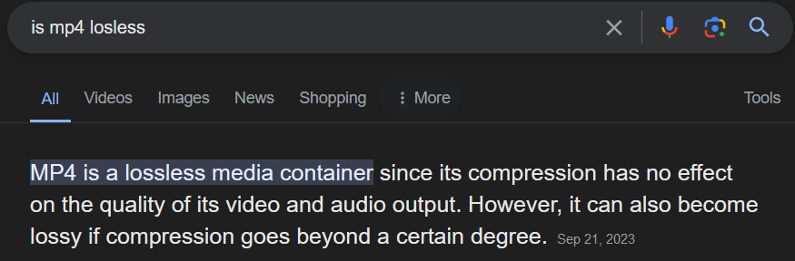

# This document is required.

In order to run processing-java, to my knowledge, you need to add it to your PATH.
This can be done by downloading another processing folder, then:
## Windows
- Going to Environment Variables
- Editing PATH and adding it as a variable
## Ubuntu
- Use `nano ~/.bashrc`
- At the very end of the file, add a little command that looks like
- `export PATH="<PATH TO PROCESSING FOLDER>:$PATH"`
Note: The processing-java file must live with processing.exe
If `processing-java` runs and gives you something that works, then you're good.

You also need to download and install FFmpeg!

# Video Stegonography: A Not Effective But Usable Solution

## Premise

If you remember our image stegonography lab that we did on Processing, we encoded stuff onto images.
This was just encoding and decoding text or images from other images, but this seems kind of limited, no?
Well, for starters, we only utilized one color channel to encode information onto, meaning the files we encode onto images are very limited in size.
**<Include a diagram about how small the encoded file has to be in comparison to the original file>**


But also if we wanted to encode a really large file, say a secret video, then we would need a *really* big image to encode it onto, which seems really suspicious and not particularly realistic.

The solution to this problem is that we can just encode files onto... multiple images. Shocking solution, I know.
But it would be really weird to just have a lot of separate images that contain data for a single file, so let's combine them.
One option is to use GIFs (or are they pronounced GIFs?), **Addition, Have them debate about this for HW** but nobody likes those so let's do something that people actually like: videos.
Theoretically, we should be able to take a video, break it down into individual frames, encode data onto some of those frames, and then patch them back into a video nicely.

## Complications

Of course this can't be that easy.
Remember how we were using PNG files for our image processing lab? Specifically how we encoded data exclusively onto PNGs?
The reason is because PNGs are lossless, meaning that an image will be exactly the same as it was saved as.
This is unlike other image file extensions, like JPEG, which can have lossy compression. Compresion is usually not noticeable, but it helps a lot with things such as decreasing the file size of your image so a couple images don't take up your entire SSD.

However, for us, this is bad. We need encoded data to remain exactly the same as we left it, or else when we extract it then our output wouldn't be what we encoded in.
Videos are, unfortuantely, a major advocate for compression, because if uncompressed individual images already take up a lot of space, you can imagine how big a video would be if it contained hundreds or thousands of those images.

So in order to be able to encode stuff onto videos and decode that same stuff back properly, we need to find ways to losslessly convert a video into frames and back into a video.

## Basic Logic

First, we need to know where we're starting. A common video file is .mp4, so we will say that is the original video file we will be given and expected to encode onto *somehow*.

Now, what can we do with this .mp4 to turn it into frames? Well, we can use a tool called FFmpeg. (Fast Forward Moving Picture Experts Group).
One use of FFmpeg is to take an input ```-i input_file``` and convert it into output files. Something like ```ffmpeg -i original.mp4 temp/original_frames%05d.png``` should suffice into turning it into frames.
Next, we would theoretically encode data with our modified encoder, which will be improved (more on that later), onto our frames.
Finally, we can turn these frames back into a .mp4 with something like ```ffmpeg -i temp/original_frames%05d.png modified.mp4```.
Our new video modified.mp4 should now have our encoded information, so now we can decode it.
We can use FFmpeg to extract our frames again with something like ```ffmpeg -i modified.mp4 temp/modified_frames%05d.png```
Finally, we can decode information from those frames, save it as a file, and boom, we are done!

That was really simple, right? Surely we don't need to avoid any of that lossless conversion stuff right..? Oh, turns out almost everything in these commands is lossy...

## But I Thought PNGs were lossless?

So now, with our 

# INSERT SOMETHING ABOUT ENCODING
Idk what you mean

## The mp4 is a Lie

So now we can just turn our encoded images back into a mp4 right? Well yes, we could, but we don't want to do that.
This is because, despite what Google may occassionally tell you, mp4 is usually a lossy format.
**<Insert screenshots of Google saying that mp4 is both lossy and lossless>**


Why is there confusion about whether or not mp4 is lossy? Well, its because mp4 files themselves aren't inherently lossy, but are usually used in conjunction with a lossy video codec.
A codec in general is a tool that compresses files in order to make them smaller and therefore more usable. For videos, we usually refer to 2 codecs: a video codec (which compresses visuals) and an audio codec (which compresses sound). For this assignment, we will only focus on the video codec aspect of things (however, since we **will** get video codec to work, we could technically collaborate with another group that does focus on audio codecs and encode onto both the sound and visuals of a video).
Anyways, mp4 files are usually used with lossy codecs (although they can handle lossless codecs). This makes sense with its popularity because lossless codecs cannot compress data very well and are generally much larger, meaning they are generally less efficient to use.
SO while we could theoretically use mp4 files, it would be easier if we just used a video format that more commonly uses lossless codecs.

So, what video format will we be using? Let's use .avi!
.avi stands for Audio Video Interleave, and it is more commonly associated with the lossless conversions that we will want to use for our encoding and decoding processes, so it will be easier to find support on how to do things.
As for the video codec we will be using is FFV1, or Fast Forward Codec Version 1, which was developed specifically to go with FFmpeg.
FFV1 is a lossless video codec, so now, we should be able to actually continue onto getting the frames of our video.

# INSERT SOMETHING ABOUT DECODING